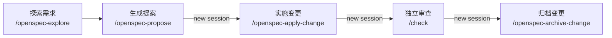

# .agents

个人 Coding Agent 配置的唯一维护仓库。

本仓库提供全局 `AGENTS.md`、Agent Skills、commands、OpenSpec 和 MCP 配置。`OiAnthony/dotfiles` 通过固定 commit 的 Git submodule 使用本仓库；不要在 dotfiles 的 submodule checkout 中直接开发。

## 直接使用

将仓库克隆到 `~/.agents`：

```bash
git clone https://github.com/OiAnthony/.agents.git ~/.agents
```

如需同步到各 AI 客户端，并且环境中已有 Bun：

```bash
bunx @oipsanthony/dotagents@latest --scope global --clients all --yes --force
```

## Coding Agent 工作流

`AGENTS.md` 是工作流的基础，约束 Agent 如何确定范围、收集证据、实施修改、验证结果和汇报结论。全局规则会与项目自己的 `AGENTS.md` 叠加，项目规则补充当前代码库的技术和业务边界。

`skills/` 提供面向具体任务的工作流：

- `/think`：在编码前澄清需求、权衡方案并形成可执行计划；
- `/hunt`：从复现和证据出发定位故障根因；
- `/check`：独立审查改动、发布条件或项目状态；
- `/openspec-*`：管理需要设计、任务拆分和归档的复杂变更。

### 轻量任务

一次会话能够完成的问题，先确定方案或根因，再实现并审查：

```text
/think → implement this plan → /check
/hunt  → fix it              → /check
```

### 复杂变更

需要设计文档和可追踪任务时，使用 OpenSpec 串联探索、提案、实现、审查和归档：



实现、审查和归档建议使用独立 session，减少实现上下文对审查判断的影响。

## 致谢

- [Andrej Karpathy](https://x.com/karpathy/status/2015883857489522876) 与 [Karpathy-Inspired Claude Code Guidelines](https://github.com/multica-ai/andrej-karpathy-skills) — Agent 行为规范的早期来源
- [Waza](https://github.com/tw93/Waza) — AI skill 系列
- [OpenSpec](https://github.com/Fission-AI/OpenSpec) — 规范驱动开发工作流

## 更新流程

1. 在本仓库的独立 clone 中修改并验证。
2. 提交并推送 `.agents`。
3. 在 dotfiles 中提升 submodule pointer。
4. 运行 dotfiles 的 Agents 集成测试。

`skills/` 只跟踪运行时需要的内容。不要提交上游仓库的网站、showcase、发布素材、缓存或本地生成状态。
