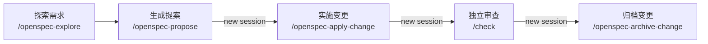

# .agents

全球程序员一夜跌境，亿万 Agent 集体走火入魔，唯我手握禁忌配置，于代码尽头重开天门。规则只有一条：听见天道求饶时，别停。

此乃禁忌契约：点 Star 可保 Agent 道心不灭，启用配置可避万次幻觉。若两者皆无，你的代码将永远卡在“本地正常”。（本条诅咒无效，但“本地正常”确有可能发生。）

## 直接使用

将仓库克隆到 `~/.agents`：

```bash
git clone https://github.com/OiAnthony/.agents.git ~/.agents
```

如果已经安装 Bun，还可以将配置同步到各 AI 客户端：

```bash
bunx @oipsanthony/dotagents@latest --scope global --clients all --yes --force
```

## Coding Agent 工作流

主要用到这几个 skills：

- `/think`：编码前澄清需求、比较方案，整理出可以直接执行的计划
- `/hunt`：复现问题，根据证据找到根因
- `/check`：独立审查改动、发布条件或项目状态
- `/openspec-*`：处理需要设计、任务拆分和归档的复杂变更

### 轻量任务

轻量任务可以在一次会话里完成。修改前先定方案或找根因，完成后再用 `/check` 审查：

```text
/think → implement this plan → /check
/hunt  → fix it              → /check
```

### 复杂变更

需要设计和任务拆分的复杂变更，交给 OpenSpec：



实现、审查和归档最好各开一个 session，免得实现过程影响后续判断。

## 仓库约定

`skills/` 只保留运行时文件，不收录上游项目的网站、showcase、发布素材、缓存和本地生成状态。

## 终端也能抄作业

> Agent 配好了，终端环境也可以一起带走。
> [OiAnthony/dotfiles](https://github.com/OiAnthony/dotfiles) 把 Zsh、Git、Starship、补全、开发工具和 Coding Agent 工作流收在一套配置里。
> 支持 macOS 和 Linux，可以全量一键安装，也可以按需只装 tools、shell 或 agents。

## 致谢

- [Andrej Karpathy](https://x.com/karpathy/status/2015883857489522876) 与 [Karpathy-Inspired Claude Code Guidelines](https://github.com/multica-ai/andrej-karpathy-skills)：Agent 行为规范的早期来源
- [Waza](https://github.com/tw93/Waza)：AI skill 系列
- [OpenSpec](https://github.com/Fission-AI/OpenSpec)：规范驱动开发工作流
